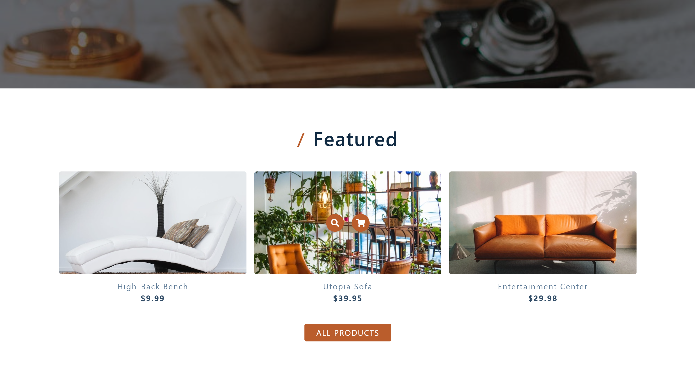
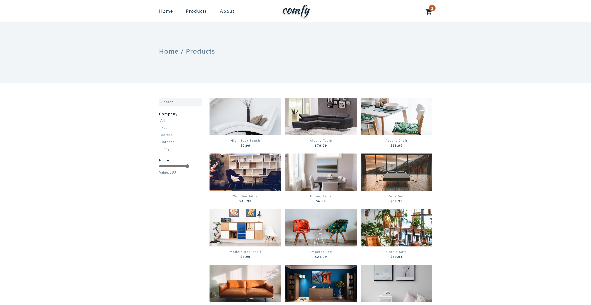
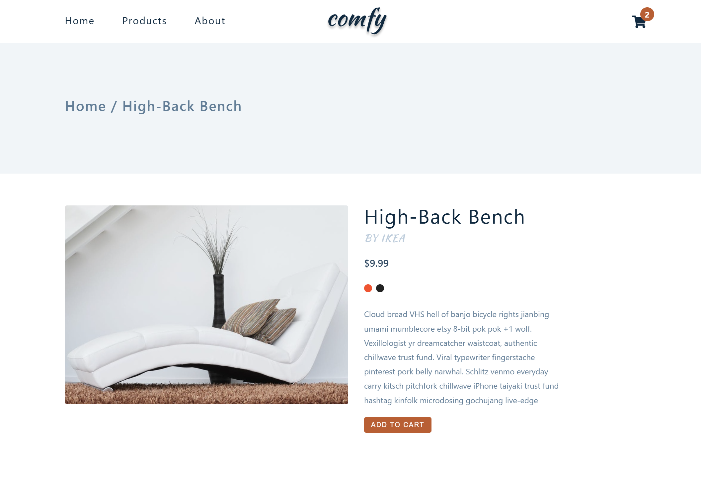
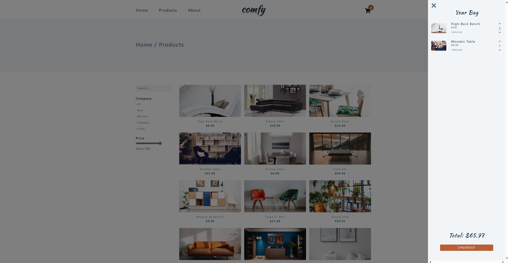

# My Comfy Store

**Disclaimer**: This project is based on the [Javascript Tutorial and Projects Course](https://www.udemy.com/course/javascript-tutorial-for-beginners-w/) John Smilga's course (project Comfy Store). The primary purpose of this repository is for personal learning and practice. All credit for the original design and concepts goes to John Smilga. This repository serves as my implementation of the project following the course.

## Overview
Welcome to the Comfy Store app! This app allows users to browse and purchase household products with ease.

## Technologies Used
- JavaScript
- HTML
- CSS

## How to Run the Project
1. Open the project

2. Run the application
Start the project from index.html (Alt + L & Alt + O or right click - Open with Live Server)

### Usage

- **Home Page**
 A welcoming, visually engaging entry point with a friendly message, a "Shop Now" button for quick access to products, and a preview of three featured items. The page provides easy navigation to explore all products and allows quick access to the cart, visible on all app pages.

 
 

- **Products page**
 The Comfy Store Products Page offers a comprehensive and user-friendly interface for browsing a wide range of household items. The page features an intuitive search bar that allows users to easily find products by various criteria such as company and price. Users can also search by typing in the search box, which is also available.
When users hover over a product image, two interactive buttons appear to enhance the browsing process. The first button redirects to the product’s dedicated page, where users can view more detailed information about the item. The second button adds the product to the cart, allowing users to quickly save items for purchase. This hover feature makes exploring and selecting products even more efficient.

- **Single product view**
 The Single Product View Page in Comfy Store provides users with an in-depth look at each item. When a user clicks on a product, they are redirected to this page, where they can see detailed information about the item. The intuitive design ensures a seamless and enjoyable shopping experience.

- **Shopping cart**
 The Shopping Cart Page in Comfy Store which appears in the right part of the screen provides users with a clear and organized view of their selected items. On this page, users can see all the products they have added to their cart, along with the option to adjust the quantity or remove items as needed. The page also displays the total price of the order. With its user-friendly design, the Shopping Cart Page makes managing purchases simple and efficient, enhancing the overall shopping experience.

